# Micromesh Asset Pipeline

The [Micro-Mesh Asset Pipeline
slides](https://developer.download.nvidia.com/ProGraphics/nvpro-samples/slides/Micro-Mesh_Asset_Pipeline.pdf)
provide an illustrated alternative to the steps described here.

We describe the core steps that would be performed to create a micromesh asset
from an original input mesh.

`:/` 

To ensure that the original asset is suitable for converting to a micromesh asset, 
please take the following steps.

1. **Pre-tessellation**

    If a mesh uses heightmaps, we want to pre-tesselate the input mesh so that
    every triangle can leverage the best possible micromesh subdivision to 
    account for detail stored in the heightmap texels. 

    The raytracing APIs limit the subdivision level to 5 (i.e 1024 microtriangles).
    If a mesh uses high resolution heightmaps, level 5 may not be enough to capture 
    all the detail within the triangle. Pre-tessellating the original geometry based
    on the heightmap resolution aims to keep the detail provided through the heightmap.

    This step can also be used to tessellate the mesh a bit so that the remesher
    has more triangles to play with.

2. **Remeshing**

    The input mesh typically contains a lot more triangles than what the base mesh
    should have. The remesher runs a mesh simplification that tries to capture
    the local detail and favors generation of isotropic triangles. It is driven by a curvature 
    based importance metric.
    
    It generates per **triangle subdivsion levels** so that they reflect either the texcoord area
    to account for additional heightmap displacement, or the number of source input triangles
    that the simplified triangle represents.

    Furthermore **direction vectors** and **direction bounds** are computed to aid the later baking process and provide
    a somewhat tight shell volume for the displacements.

`:)`

At this point we have now generated the **base mesh** with its **vertex positions** and
**triangle vertices**. The remesher would also supply additional properties.

3. **Mesh Topology Building**

    Multiple subsequent operations depend on neighborhood information.
    This step computes the mesh topology (that is connectivity among triangles,
    vertices and edges) based on the vertex positions (matching raw float values).

4. **Subdivision Level Computation and/or Sanitization**

    If the remesher is not used we need to set the subdivision amount for the base mesh
    triangles. This is typically driven by either a texel area based heuristic, or 
    an edge length (in object space) relative to a reference value.

    To ensure that subdivision levels are compatible with the raytracing APIs
    we use the topology information so that adjacent triangles can only
    differ by one level.

    This gives us the **triangle subdivison levels** used by the baker and
    we can also compute the **triangle primitive flags** used by the final
    rendering.

5. **Direction Vector Computation**

    Either use vertex normals or smooth triangle normals as
    **vertex direction vectors** for the raytracing in the micromap baking.

    We recommend smooth normals, as vertex normals could result in visible cracks
    in the mesh when the shading vertex normals had hard edges.

    This will be skipped if the remeshing was run.

6. **Micromap Baking And Texture Resampling**

    In this step we shoot rays from the base mesh towards the original input
    mesh and compute the per-microvertex displacements.

    This operation can also do a fitting operation to create tighter shell
    volume. We compute new direction bounds based on the sampling results
    and resample in the new perturtabed directions.

    To account for the texture coordinate perturbations that the fitting or
    remeshing have introduced, we recommend that original textures
    are resampled as well. This happens particularly in the case of normal maps, 
    where tangent space changes dramatically after remeshing.

    The baker can do this for any texture and also create tangent space normal maps.
    It runs a rudimentary pull-push filter on the textures to fill the gaps between
    UV islands.

`=)`

We now have the **base mesh** with all its required properties 
and the **uncompressed displacement micromap**.
The asset would also have the final **resampled textures**.

7. **Micromesh Optimization**

    The last operation is to analyze the uncompressed data and compress it
    using a quality metric that a user can tweak.

    This operation also computes additional meta information, such as block format
    usage histograms, that is required by the raytracing APIs.

    Next to raytracing data, it can also compute some additional packed mip data to aid 
    rasterization shaders that do on-the-fly decoding of compressed data.

`=D`

Finally we completed the pipeline by having generated a **compressed displacement micromap**,
which is required by the raytracing APIs.

Our final asset is made of:
- base mesh 
  - triangle vertices
  - triangle primitive flags
  - vertex positions
  - vertex directions
  - vertex direction bounds
- compressed displacement micromap
- resampled textures

## Caveats

The provided pipeline is a work in progress and meant to be a starting point for
baking and modelling tool companies or technical artists to evaluate displaced micromeshes.

There are some known issues:

- The tools require somewhat well behaved inputs. Therefore, open edges, wrong triangle winding
  or non-manifold surfaces can yield undesired results, especially in the remeshing process,
  but also during the baking.
- We do not have CPU fallbacks for all steps in the pipeline, and we have not tuned all GPU
  algorithms with regards to memory usage, especially the remeshing of very large input meshes
  will require graphics cards with lots of VRAM.
- By design scalar displacement is challenged by hard / sharp edges.
  That means hardsurface models can have quality issues, especially as the orientation of the
  base triangle, and therefore the microvertex sampling points, might face aliasing issues
  when the model has very sharp features.
- Micromaps are designed to allow reuse / instancing of data, 
  but the tools here just don't support it yet.
- When turning simple quads into complex shapes through heightmaps, the current tooling
  will not account for tiled heightmaps. Meaning there is no guarantee that the
  displacement values match along the wrap-around edges. A developer would have
  to artificially manipulate the mesh topology class to create virtual connectivity.

## Best Practices

The top level advice for processing assets is to start with clean geometry,
especially for the base mesh or for input to the remesher. Open edges (e.g.
T-junctions), non-manifold geometry (e.g. self-intersecting), or layers of
normally-hidden geometry (especially with heightmap displacement) can cause
problems. The baker is more forgiving of noisy geometry in the reference mesh
compared to the base mesh, or the input when remeshing is active.

Displacement Micro-Maps excel at compression. To get the most out of it,

- *Match detail frequency*

  Micromesh triangles are cheaper, but not free. Ideally each one captures
  important detail.

  If the maximum subdivision level of 5 is not enough, pre-tessellate the base
  geometry.

  If the base geometry is too dense in some areas, micromaps support different
  subdivision levels per-triangle. The remesher generates subdivision levels
  automatically, or you can set the baker's Subdivision Mode to Adaptive3D or
  AdaptiveUV. If you are writing code to generate subdivision levels, note that
  subdivision levels between adjacent triangles must not differ by more than
  one; given an arbitrary array of subdivision levels, you can use
  `meshopsOpSanitizeSubdivisionLevel()` to ensure this.

  If the base geometry is much too dense, decimate it. Consider using the SDK's
  remesher in Rate mode to do this. Some decimation tools can produce highly
  anisotropic triangles, which are best avoided with micromaps.

- *Use high subdivision levels*

  The compression ratio improves with higher subdivision levels. In fact, level
  2 and below are to be avoided; the compressor's smallest block format uses
  subdiv level 3, which means that data for levels 2 and below will be
  zero-padded, and the output at these levels can be larger than the input. In
  other words, if you're baking at level 2 or below, you can bake at level 3 to
  get more detail with no increase in the size of the compressed .bary file.

- *Fit direction bounds to the reference geometry*

  Vertex direction bounds define minimum and maximum displacement values, i.e. 0
  and 1. Quantization is an important part of compression and it's important to
  increase the density of possible displacement values where the reference
  geometry appears. That is, if the direction bounds are too big, there will be
  visible steps in the displacement levels.

  Raytracing performance depends heavily on good direction bounds because the
  acceleration structure is built from the direction bounds. If they're too big,
  rays will query microtriangles unnecessarily.

- *Use istropic base triangles*

  The micromesh subdivision scheme is uniform. Long skinny triangles will have
  good microvertex sampling frequency in one direction and poor in the other.
  Even when over-sampling, the asymmetry in displaced triangle density is
  visibly jarring.

  The remesher will preferentially generate isotropic triangles. One trick to
  improving triangle isotropy is to first over-tessellate, and then decimate
  back down with the remesher.

## Common Failure Cases

There are many ways micromesh processing can fail or give poor results. Some are
listed below. Generally, they are caused by issues with the base geometry. Once
you see a problem it can be tricky to narrow down the root cause.
[`micromesh_toolbox`](../micromesh_toolbox/README.md) has a number of
visualization modes to help finding problematic geometry and otherwise hidden
values such as uneven triangles, open edges and poor direction vectors and
bounds.

### Raytracing setup for baking

Keep in mind that the baker will be tracing rays from the base mesh, looking for
the closest hit to the surface. Bounds fitting can also add complexity, causing
rays to shoot in unexpected ways - a surprisingly complex optimization problem.

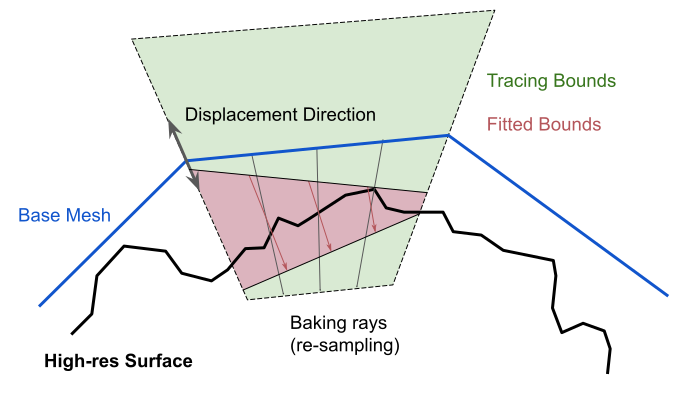

### Overhangs

Surface overhangs cannot be represented and will be covered.

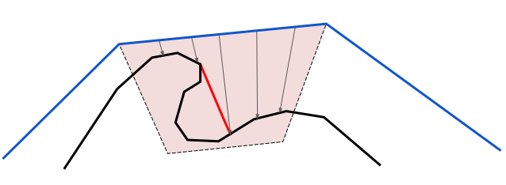

### Ray misses

Rays may completely miss geometry, in which case the displacement will be reset
to match the base geometry, although this isn't always possible with bounds
fitting.

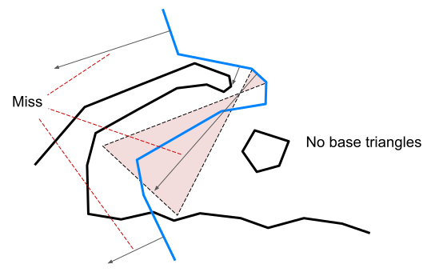

### Ray distances and bounds fitting

If the trace distance (as defined by any initial bounds) is too small, misses
typically produce holes where the distance suddenly changes to the base geometry
(left). If the trace distance is large enough but the current bounds are too
small, e.g. during bounds fitting, the distance is clipped (right).

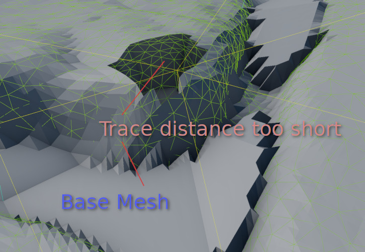
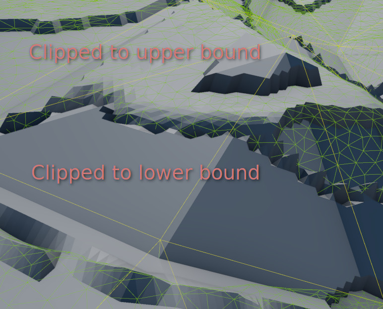

Perhaps worse, rays may miss the intended geometry and hit a different
part of the reference geometry much further away.

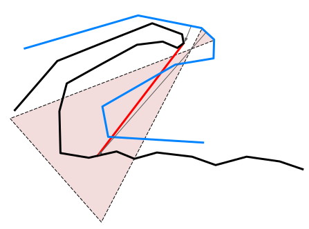
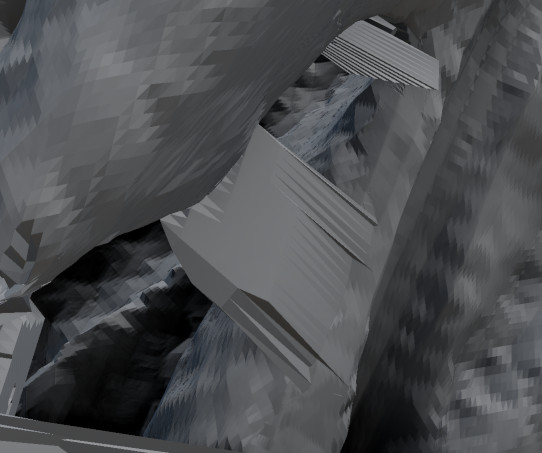

### Remeshing impact on baking

The remesher can be sensitive to mesh topology and can fail when decimating to
extreme levels. It may also error out if it's unable to reach the desired
triangle count. There can be cases where the geometry may look reasonable at
first glance, but baking with it as a base mesh produces poor results. In the
images below the geometry is still technically manifold but vertices have been
merged in such a way that there are now two thin overlapping layers. When
baking, rays near the sharp bends may miss the nearby reference mesh and instead
be displaced onto geometry far away, forming spikes.

Unchecking the *Fit to original surface* remesher option may help in extreme
remeshing cases. See [meshops_remesher/README.md](../meshops_remesher/README.md)
for more information.

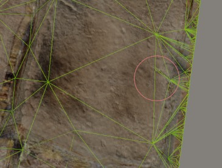
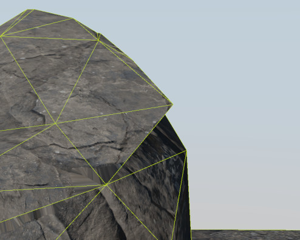

Decimating too much, e.g. more than a factor of 1024&#215;, will likely result
in undersampling the reference surface as there is a maximum of 5 subdivision
levels.

### Anisotropic triangles

Long, skinny "anisotropic" triangles produce poor results. Tessellation helps a
little but wastes geometry in the other dimension and still looks bad.
Over-tessellating and then decimating with the remesher can sometimes help.
These triangles can be found by visualizing anisotropy with `micromesh_toolbox`.

### Bounds fitting and quantization

If the bounds are poorly fitted, quantization artefacts appear in the
displacement. This is where the accuracy of the displacements is not great
enough to displace to the right distance (see the image below).

The same effect can also happen with heightmaps, particularly for
8-bit-per-channel images. Quantization issues in the heightmap can then be baked
into the micromesh even if there are good direction bounds. Using
16-bit-per-channel heightmaps and a good bias and scale helps avoid this issue.

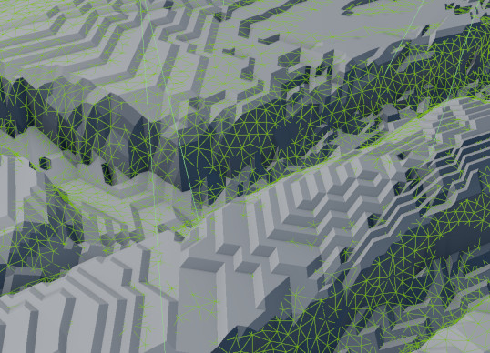

### Surface cracks

Cracks can be caused by many things, but a lot has been done to avoid them. The
following are the more common causes.

- Vertices in glTF and many formats are split into multiple if triangles with
  shared vertex positions have different normals, texture coordinates etc. The
  NVIDIA Micro-Mesh SDK often builds a second water-tight topology that is used
  to keep these split vertices in sync as long as the positions are identical.
  Any slight change in the position may break them apart. Even if the gap is not
  noticeable before, it may be large after remeshing (left image below) or
  applying heightmap or micromap displacement. Use the *Shared Position*
  visualization to find such disconnects.
- Base triangles can have different subdivision levels. To avoid cracks between
  shared edges after displacement, the triangle with higher subdivision level
  needs to decimate its edge. It does so with **triangle primitive flags**.
  These are included in the *Subdivision Level* visualization. Missing or
  incorrect primitive flags can cause cracks (right image below).

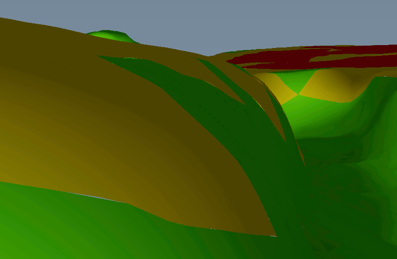

## Toolbox Visualization Modes

Some visualizations are intended for use with the base mesh and some with
micromap displaced meshes after baking.

- *Raster -> Shell -> Base* shows the lower (blue) and upper (yellow) bounds.

  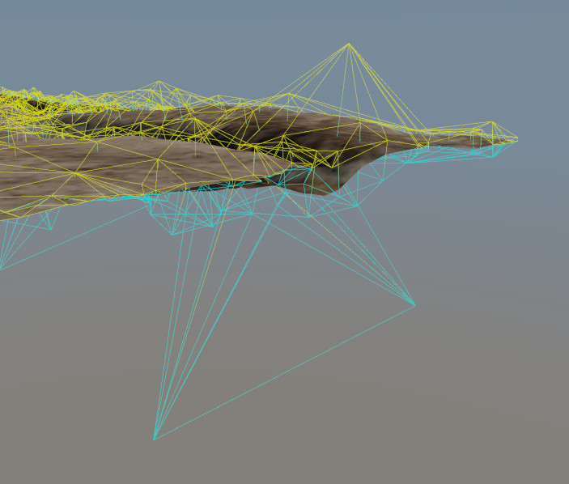

- *Raster -> Shading -> Anisotropy* shows a heatmap of how even the triangle
  edges are. Red triangles may produce poor results after baking.

  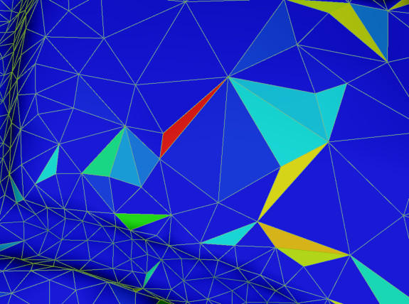

- *Raster -> Shading -> Opposing Directions* shows triangles with mis-aligned
  direction vectors. A little is OK but too much often indicates a problem,
  particularly when fitting direction bounds.

  *Raster -> Extra -> Debug -> Direction* draws the direction vectors as lines.

  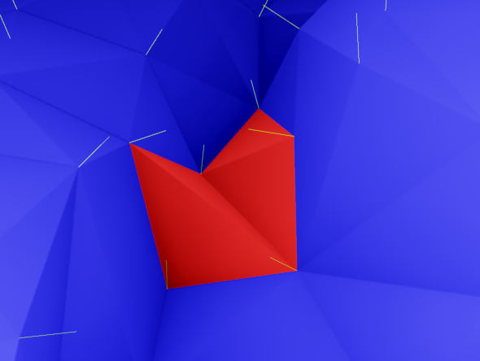

- *Raster -> Shading -> Heightmap Texel Frequency* shows a heatmap of triangles
  with subdivision levels too low to match the detail in their heightmap (or
  pink if there is no heightmap). Blue is ideal, anything else indicates
  possible under-sampling. The pre-tessellator can address this.

  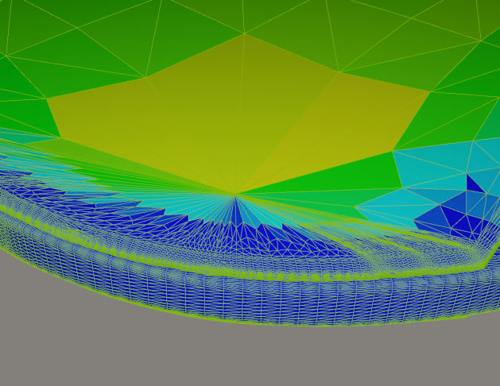

- *Raster -> Shading -> Shared Position* colors the tips of triangles with a
  hash of their position. This makes it easier to see when triangle vertices do
  not have identical positions as their neighbors.

  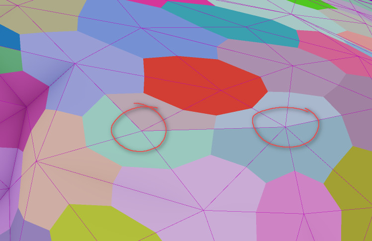

- *Raster -> Shading -> Subdivision Level* shows a heatmap of each triangle's
  subdivision level. If primitive flags are provided, and they should be if the
  subdivision levels are not all the same, a gradient will be drawn along
  triangle edges to show transitions. This can be used to debug incorrect edge
  flags by looking for color transitions without a smooth gradient, or with two.

  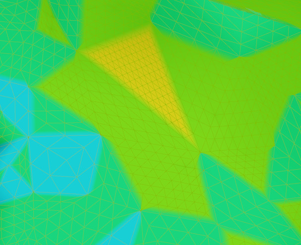
