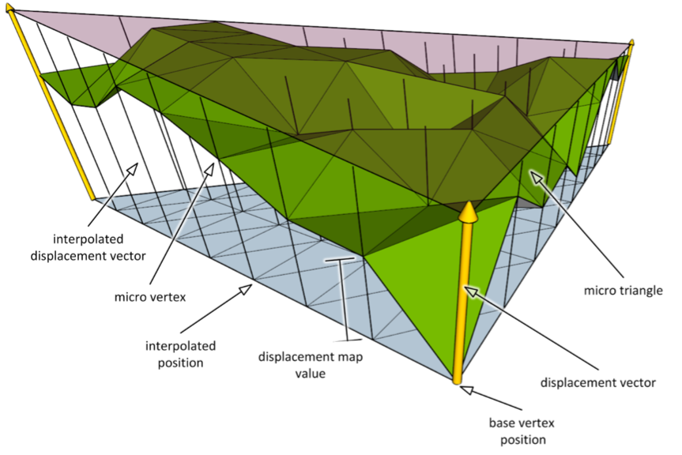

## Fundamental Data Structures

A **micromesh** is the result of subdividing a base triangle using a power of two scheme.
It is made of **microtriangles** and **microvertices**.

```
Triangle W,U,V

          V                     V                       V
          x                     x                       x
         / \                   / \ micro               / \
        /   \                 /   \ triangle          x _ x microvertex
       /     \               /     \                 / \ / \
      /       \             x _____ x               x _ x _ x
     /         \           / \     / \             / \ / \ / \
    /           \         /   \   /   \           x _ x _ x _ x
   /             \       /     \ /     \         / \ / \ / \ / \ 
  x _____________ x     x _____ x _____ x       x _ x _ x _ x _ x
W                  U   W                  U   W                   U

Subdivision level 0    Subdivision level 1    Subdivision level 2
  1 microtriangle        4 microtriangles       16 microtriangles
  aka base triangle
```

The raytracing APIs support subdivision levels up to level 5 (1024 microtriangles).
The SDK processing is not limited to this.

**Micromaps** store the data associated with the base triangles. One can think of them
as a texture that isn't sampled by texture coordinates, but they are access through
the barycentric integer coordinates of microtriangles or microvertices.

- **Opacity micromaps** provide per microtriangle opacity information (formats for 1 or 2 bits per microtriangle exist).
  The raytracing hardware can make use of this information to avoid calling the `AnyHit` shader to determine whether
  an intersection on the base triangle is accepted or discarded.

- **Displacement micromaps** provide per microvertex scalar displacement. 
  The raytracing APIs only consume block-compressed displacement data, which is the primary
  product of this SDK.
  During rendering the subdivided geometry is generated on the fly from highly compressed data, 
  so more geometry can fit in video memory.

The per microvertex or microtriangle data is laid out following a spatial curve according to the **micromap layout**. 
The raytracing APIs only support a curve called **"bird curve"**, which follows a recursive splitting logic.
The tools, however, also support storing data in u-major order, and the processing even allows for generic layout
functions.

Compression schemes for these values exist and are referred to as **block format**.

A **micromap triangle** contains information for one such subdivided base triangle, i.e. how much
it is subdivided and where to find the raw per-microvertex or per-microtriangle values. It also
provides information about the block format used.

``` cpp
struct MicromapTriangle {
    // the subdivision level (how much data it provides)
    uint16_t subdivisionLevel;
    // 
    uint16_t blockFormat; /
    uint32_t valueOffset; // in bytes for compressed data, index for uncompressed
};

struct Micromap {
    // information about each micromap triangle
    MicromapTriangle triangles[];

    // per-microvertex or per-microtriangle data
    ValueType         values[];

    // the following data is used by tooling and not relevant
    // to the raytracing APIs, because they have a fixed behavior.

    // Frequency of the data can be either per-microvertex or per-microtriangle
    // The raytracing APIs would use per-microvertex for displacement
    Frequency        valueFrequency;
    // storage layout of the data
    // The raytracing APIs mandate the "bird curve" layout
    MicromapLayout   valueLayout;
    // format of the values. 
    // The raytracing APIs support only one specific
    // compressed format for displacement and another one for opacity,
    // so they ignore this as well.
    Format            valueFormat;
};
``` 

A base mesh comprised of many base triangles can use a per triangle **mapping index** to point towards
a specifc micromap data. This allows instancing the same micromap data for multiple base mesh triangles.
If this mapping buffer doesn't exist, we use a 1:1 mapping between them.

``` cpp
micromapTriangleUsed = micromap.triangles[mesh.triangleMappings ? 
                                        mesh.triangleMappings[meshTriangleIndex] 
                                      : meshTriangleIndex];
```

Each base triangle can have a different subdivision level, but to ensure watertightness
they are allowed to only differ by one subdvision level and that information
must be provided as **primitive flag**. If the *i-th* bit within the flag is set
it means the *i-th* edge has a neighboring triangle with a subdivision level that is one
less than the current base triangle. The edges are defined in the following
order `{v0,v1},{v1,v2},{v2,v0}`.

``` cpp
struct Mesh {
    // index buffer for vertex data
    uvec3    triangleVertices[];

    // if used provides information about adjacent subdivision levels
    // allows to preserve watertightness for displacement
    uint8_t  trianglePrimitiveFlags[];

    // optional allow re-use of micromap data on different mesh triangles
    // otherwise 1:1 mapping is used
    uint32_t triangleMappings[];

    // vertex positions
    vec3  vertexPositions[];
    // for displacements we need direction vectors
    // (hardware will use fp16 internally)
    fp16vec3 vertexDirections[];
    // optional per-vertex scale and bias directly 
    // applied during BVH build time
    // (can also be supplied as fp16)
    vec2 vertexDirectionBounds[];
};

```



The **displacement** is performed using linear interpolation and the microvertex
barycentric UV coordinate:

``` cpp
// scalar displacement through linear interpolation
// ------------------------------------------------

pos0 = ... // posN and dirN are the base triangle's vertex positions and directions

displaced_pos = linearInterpolation(pos0, pos1, pos2, microvertex.barycentricUV) +
                linearInterpolation(dir0, dir1, dir2, microvertex.barycentricUV) *
                microvertex.displacement;
```

Note, as displacement values are represented as `unorm` in the raytracing APIs,
the hardware is able to leverage the shell for culling. This shell is a prismoid formed by an extrusion
of the base triangle's minimum (`displacement = 0`) towards the maximum (`displacement = 1`).

``` cpp
// A prismoid formed by min and max triangle is 
// used by raytracing hardware for culling
// ---------------------------------------
//
//  prismoid   x
//            /.\  
//           / . \  max_triangle
//          x_____x (pos + dir)
//          |  .  | 
//          |  x  |
//          | . . |
//          |.   .| min_triangle
//          x_____x (pos)
//

min_triangle = {pos0,        pos1,        pos2};
max_triangle = {pos0 + dir0, pos1 + dir1, pos2 + dir2};

```

Ideally we pre-condition the position and direction and displacement data so that this
prismoid volume is minimized. It also helps to make better use of the unorm precision,
as the raytracing APIs represent displacement as `unorm11` data.


To avoid having to change all position and vertex data, the raytracing APIs also
provide an optional per-vertex **scale and bias** value. We refer to these as
**direction bounds**. They can be passed into the BVH builder as well.

``` cpp

// direction bounds / scale & bias application during BVH build time
// -----------------------------------------------------------------

bounds0 = ... // fetch posN and dirN as before and boundsN accordingly

// bvh builder does an on the fly correction when using per-vertex scale and bias
// also known as direction bounds
pos0 = pos0 + dir0 * bounds0.bias;
dir0 = dir0 * bounds0.scale;

```
The BVH builder will store these modified positions and directions in the BVH as
new base triangle. Therefore fetching the triangle vertex positions from the 
BVH using intrinsics will return these modified values and not the original input.

> **Warning**
> Be aware that non-uniform bias/scale creates a perturbation that
> may affect texture lookups. This typically means textures have to
> be resampled to account for this!