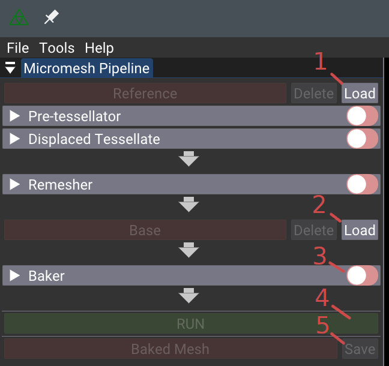
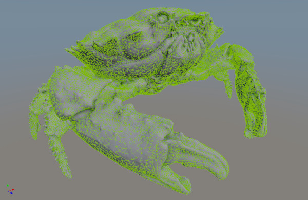
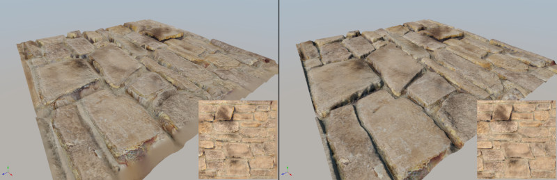

# Example use-cases

This document has a few hands on examples using the [NVIDIA Displacement
Micro-Map Toolkit](../). Processing assets has some quirks. For a more thorough
discussion, see [Micromesh Asset Pipeline](asset_pipeline.md). It includes some
[best practices](asset_pipeline.md#best-practices) and examples of [common
failure cases](asset_pipeline.md#common-failure-cases).

The examples below can be processed with both the GUI,
[`micromesh_toolbox`](../micromesh_toolbox/README.md) and command line
interface, [`micromesh_tool`](../micromesh_tool/README.md). To build them, see
[Building](../README.md#building).

## Meshes

The following models are provided to demonstrate some common mesh processing
operations for micromap rendering. The example use-cases use the first two,
`reefcrab.7z` and `wall.7z`. Download these to get started but feel free to try
your own.

- [Crab](https://developer.download.nvidia.com/ProGraphics/nvpro-samples/reefcrab.7z)
- [Wall](https://developer.download.nvidia.com/ProGraphics/nvpro-samples/wall.7z)
- [Rocks](https://developer.download.nvidia.com/ProGraphics/nvpro-samples/rocks.7z)
- [PingPongPaddle](https://developer.download.nvidia.com/ProGraphics/nvpro-samples/pingpongpaddle.7z)

## High + low poly meshes

There is one large mesh with a triangle budget much too high for GPU memory.
There is also a decimated low-poly mesh that closely matches the surfaces of the
high poly mesh. The toolkit baker can trace rays from it to the high-poly mesh
to generate the micromap. The baker will default to tracing a short distance in
both directions away from the low poly mesh. This may need to be adjusted for
some meshes.

With micromesh_toolbox.exe (GUI):

1. Load the high poly `reefcrab/reefcrab.gltf` into the *Reference* slot
2. Load the low poly `reefcrab/reefcrab_remesh.gltf` into the *Base* slot
3. Enable the *Baker* stage
4. Click *Run*
5. (Optional) Click *Save* next to *Baked Mesh*

To see the micromap wireframe, choose *Raster -> Overlay -> Baked* on the right.
To see the original geometry, choose *Rendering -> Geometry -> Reference* on the
left or just click *Reference* on the left. To see the displacement bounding
shell, choose *Raster -> Shell -> Base* on the right. Tight bounds are important
for good raytracing performance.

Choosing *Raster -> Shading -> Default* will look flat because there is no
micro-vertex normal data. See the resampling example below for generating a
normal map.

Command line: `micromesh_tool.exe --input reefcrab/reefcrab_remesh.gltf --output reefcrab_with_micromap.gltf bake --high reefcrab/reefcrab.gltf --level 5`

micromesh_toolbox.exe can be used to view the baked reefcrab_with_micromap.gltf

## High poly mesh only

A decimated mesh is always needed, but it can be generated from the high poly
mesh. The toolkit provides a micromesh targeted decimator, called the remesher.
The remesher optimizes for evenly sized isotropic triangles, which give nicer
results with displacement micromaps. Once generated, the baker can produce a
micromap as above. The remesher embeds additional data in the intermediate glTF
so adjusting the trace distance may not be required.

High poly meshes often do not have UVs. It may be desirable to remesh first,
save and UV unwrap the result, then continue to baking as above.

With micromesh_toolbox.exe (GUI):

1. Load `reefcrab/reefcrab.gltf` into the *Reference* slot
2. Enable the *Remesher* stage
3. Enable the *Baker* stage
4. Click *Run*

Command line: `micromesh_tool.exe --input reefcrab/reefcrab.gltf --output reefcrab_with_micromap.gltf {remesh --decimationratio 0.1} {bake --level 5}`

## Low poly mesh with heightmap

In the case a heightmap already exists and a micromap is needed instead, it can
be baked directly. Note that the glTF format uses the KHR_materials_displacement
extension to define heightmaps. If these are missing, the script
`./automation/link_heightmaps.py` may be able to find and re-link them.

For this example, `wall/wall_quad/wall.gltf` is just a quad with textures. It
includes a heightmap, referenced with glTF `KHR_materials_displacement`.

With micromesh_toolbox.exe (GUI):

1. Load `wall/wall_quad/wall.gltf` into the *Base* slot (leave *Reference*
   empty)
2. Enable the *Baker* stage
3. Click *Run*
4. Note insufficient detail is baked because the scene is just one quad.
5. Instead, load `wall/wall_quad/wall.gltf` into the *Reference* slot
5. Enable the *Pretessellate* stage
6. Click *Run*

The wall archive includes `wall/wall_quad/wall_pretess.gltf`, which is the
result of pre-tessellation - just a grid of triangles. This can be loaded into
the *Base* slot and baked directly with reasonable detail.

`micromesh_toolbox` has a visualization *Raster -> Shading -> Heightmap Texel
Frequency*, which highlights triangles that are too coarse to match the target
bake subdivision level. With default coloring, blue triangles match well and red
triangles need tessellating or the heightmap will be under-sampled if baked.

Command line: `micromesh_tool.exe --input wall/wall_quad/wall.gltf --output wall_with_micromap.gltf {pretessellate} {bake --level 5}`

## Resampling textures

Textures may exist for the high poly mesh, but if they are to be used with the
micromap-displaced low poly mesh they must be resampled. This is because baking
flattens, or "projects", the high poly detail onto the low poly mesh. Distortion
occurs when the high poly geometry is relatively steep compared to the low poly
triangles. Resampling is not necessary when baking just one mesh with a
heightmap.

Resampling is particularly important for normal maps on the high poly mesh as
they are defined in per-vertex tangent space that may abruptly change between
triangles.

For this example, `wall/wall_geometry/wall.gltf` contains high poly geometry
including a normal map. This will be baked onto
`wall/wall_geometry/quad_pretess.gltf`, which is a flat grid referencing
the same textures as `wall/wall_geometry/wall.gltf`.

With micromesh_toolbox.exe (GUI):

1. Load `wall/wall_geometry/wall.gltf` into the *Reference* slot
2. Load `wall/wall_geometry/quad_pretess.gltf` into the *Base* slot
3. Enable the *Baker* stage
4. Click *Run*
5. Note the result looks stretched, flat and unlit because the high poly
   textures textures are being blindly applied to the displaced quad.
6. Set *Baker -> Resample Textures -> All Textures*
7. Click *Run*

Command line: `micromesh_tool.exe --input wall/wall_geometry/quad_pretess.gltf --output resampled_wall_with_micromap.gltf {bake --high wall/wall_geometry/wall.gltf --level 5 --resample all}`

The color texture does not change because both high and low resolution meshes
use a planar projection, but the normal map has a change of basis for the new
tangent space.

## High poly mesh with heightmap

Sometimes the reference geometry is defined with both a detailed mesh and a
heightmap. The baker will automatically tessellate and displace the reference
scene if it has a heightmap. The *Displaced Tessellate* operation could be used
too, but the baker is able to generate this geometry on the fly and in batches
to save memory.

For this example, `wall/wall_decimated/wall.gltf` is a coarsely decimated
version of `wall/wall_geometry/wall.gltf`, with a heightmap applied to match the
original geometry. Unlike `wall_quad`, the displacements from the heightmap are
not straight up but in the various directions of vertex normals.

The rocks.gltf mesh is another good example to try this with.

With micromesh_toolbox.exe (GUI):

1. Load `wall/wall_decimated/wall.gltf` into the *Reference* slot
2. Load `wall/wall_geometry/quad_pretess.gltf` into the *Base* slot
3. Enable the *Baker* stage
6. Set *Baker -> Resample Textures -> All Textures*
4. Click *Run*

Command line: `micromesh_tool.exe --input wall/wall_geometry/quad_pretess.gltf --output resampled_wall_with_micromap.gltf {bake --high wall/wall_decimated/wall.gltf --level 5 --resample all}`
